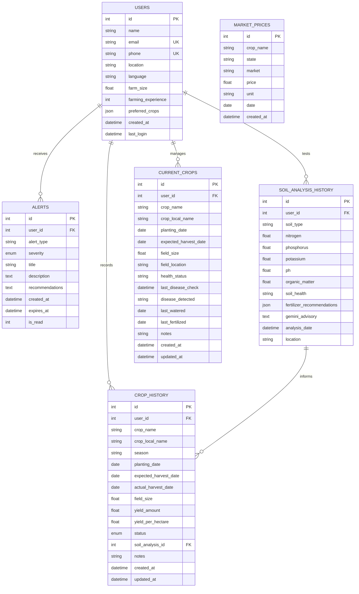

# 🌾 Project Architecture: AgriDarshak (Farmer Distress Early-Warning System)

> **SIH 2026 Platform Technical Architecture & Audit**  
> **Platform:** AgriDarshak  
> **Status:** Audited & Operational

---

## 1. System Overview & Vision

The **AgriDarshak** platform is an AI-powered agricultural decision-support and proactive crisis mitigation system designed for Indian farmers. 

The system transitions from isolated farming utilities (soil testing, weather forecast, disease detection, mandi price tables) into an **integrated early-warning platform** that actively monitors environmental, agronomic, and financial distress signals to alert farmers before catastrophic crop failure or financial losses occur.

```
+-----------------------------------------------------------------------------------+
|                                  USER / FARMER                                    |
+-----------------------------------------------------------------------------------+
                                         │ (Web / Mobile Browser)
                                         ▼
+-----------------------------------------------------------------------------------+
|                        FRONTEND (React 18 + Vite SPA)                             |
|  - React Router 6.28                  - Multi-language i18n (7 Indian Languages)  |
|  - Framer Motion UI                   - Text-to-Speech Engine (Web Speech API)    |
|  - Reactive Alert Banners             - Modular CSS Design System                 |
+-----------------------------------------------------------------------------------+
                                         │ (HTTP / JSON via Vite /api Proxy)
                                         ▼
+-----------------------------------------------------------------------------------+
|                       BACKEND API (FastAPI + Uvicorn)                             |
|  ├── Routes Layer:    auth, soil_analysis, crop_recommendation, disease,          |
|  │                    weather, market_prices                                      |
|  ├── Services Layer:  gemini_service, climate_alert, crop_recommendation,         |
|  │                    disease_detection, leaf_validator, weather_service,         |
|  │                    market_price_service, context_service, otp_service          |
|  └── Data Layer:      SQLAlchemy ORM + SQLite (crop_advisory.db) / PostgreSQL     |
+-----------------------------------------------------------------------------------+
          │                             │                              │
          ▼                             ▼                              ▼
+--------------------+        +--------------------+        +---------------------+
|   AI / ML MODELS   |        |   EXTERNAL APIS    |        |  DATABASE STORAGE   |
| - MobileNetV2 (38c)|        | - Open-Meteo API   |        | - users             |
| - Leaf Validator   |        | - Data.gov.in      |        | - alerts            |
| - Gemini 2.5 Flash |        | - SendGrid Email   |        | - market_prices     |
|   (google-genai)   |        | - Twilio SMS OTP   |        | - soil_analysis_hist|
+--------------------+        +--------------------+        | - crop_history      |
                                                            | - current_crops     |
                                                            +---------------------+
```

---

## 2. Frontend Modules & Architecture

### 2.1 Tech Stack
- **Framework:** React 18.3.1
- **Build Tool:** Vite 6.4.1 (with dev proxy `/api` pointing to `http://localhost:8000`)
- **Routing:** React Router v6.28.0 (with future flags enabled)
- **Styling:** Custom CSS Design System (`styles/index.css`, `FeaturePage.css`, `Dashboard.css`, `Auth.css`, `AppLayout.css`)
- **Localization:** `react-i18next` + `i18next` supporting 7 Indian languages (English, Hindi, Tamil, Telugu, Bengali, Marathi, Gujarati)
- **Animation & Icons:** `framer-motion` 11.15.0, `react-icons` 5.4.0
- **Media & File Handling:** `react-dropzone` 14.3.5
- **Markdown & Speech:** `react-markdown` 10.1.0, Browser Web Speech API (`window.speechSynthesis`)

### 2.2 Component & Page Breakdown

| Module / Page | File Path | Description | Key Capabilities |
|---|---|---|---|
| **Root Application** | `frontend/src/App.jsx` | Main application router & auth state | Global auth management, sync with `localStorage`, mounts global `AlertBanner`. |
| **App Layout** | `frontend/src/components/AppLayout.jsx` | Persistent navigation shell | Header brand, desktop/mobile responsive nav, language selector dropdown, logout action. |
| **Landing Page** | `frontend/src/pages/Landing.jsx` | Public promotional landing | Hero section, animated feature cards, call-to-action, language switcher. |
| **About Page** | `frontend/src/pages/About.jsx` | Mission & tech overview | Project purpose, farmer benefits, technology commitments. |
| **Authentication** | `frontend/src/pages/Login.jsx`<br>`frontend/src/pages/Register.jsx` | User authentication | Dual Email/SMS OTP request and verification (with dev mock autofill), registration with location & language. |
| **Dashboard** | `frontend/src/pages/Dashboard.jsx` | Farmer home command center | Personalized welcome with location, live severe weather & climate alerts feed, quick navigation to 6 core tools. |
| **Soil Analysis** | `frontend/src/pages/SoilAnalysis.jsx` | NPK & pH analysis | NPK & pH parameter input, soil health rating (Good/Medium/Poor), fertilizer schedule, historical analysis drawer, Gemini audio advisory. |
| **Soil Type Detection** | `frontend/src/pages/SoilTypeDetection.jsx` | Soil classification | Dual-mode: manual dropdown or soil photo upload dropzone, physical characteristics breakdown, crop suitability explanation. |
| **Crop Recommendation**| `frontend/src/pages/CropRecommendation.jsx`| Multi-factor crop matching | Soil type, location, season, temperature input; multi-factor ranking; Gemini agricultural explanation with TTS. |
| **Live Weather & Alerts**| `frontend/src/pages/Weather.jsx` | Weather monitoring | Real-time temperature, humidity, wind speed, state/city selector, 5-day forecast, climate alerts list. |
| **Disease Detection** | `frontend/src/pages/DiseaseDetection.jsx` | Plant pathology AI | Drag-and-drop leaf image upload, leaf validation check, MobileNetV2 38-class detection, confidence score, Gemini treatment advisory, email alert. |
| **Market Prices** | `frontend/src/pages/MarketPrices.jsx` | Mandi price intelligence | State and city mandi selector, current season crop cards, price trend badges (Up/Down/Stable), crop search with datalist autocomplete. |
| **Alert Detail** | `frontend/src/pages/AlertDetail.jsx` | Incident detail view | Full severity view, Gemini disaster/weather response recommendations, automatic mark-as-read. |
| **Advisory Markdown** | `frontend/src/components/AdvisoryMarkdown.jsx`| Formatted advisory renderer | Parses structured markdown headings, integrates `TextToSpeech` component. |
| **Alert Banner** | `frontend/src/components/AlertBanner.jsx` | Global alert banner | Sticky banner across authenticated routes for critical weather/disease events within 24h. |
| **Text-to-Speech** | `frontend/src/components/TextToSpeech.jsx` | Regional voice player | Converts Gemini advisories to plain text and synthesizes speech in 7 regional Indian language accents. |

---

## 3. Backend Modules & Architecture

### 3.1 Tech Stack
- **Framework:** FastAPI 0.115.0
- **ASGI Server:** Uvicorn 0.32.0
- **ORM & Database:** SQLAlchemy 2.0.36, SQLite 3 (production-ready for PostgreSQL)
- **AI/LLM SDK:** `google-genai` >= 1.0.0 (Google Gemini 2.5 Flash)
- **Deep Learning:** PyTorch + TorchVision (MobileNetV2)
- **Image Processing & Math:** Pillow, NumPy
- **Validation & Settings:** Pydantic 2.9.2, `pydantic-settings`, `email-validator`

### 3.2 Backend Directory Structure

```
backend/
├── app.py                      # FastAPI entry point, CORS, router mounting, startup hook
├── config.py                   # Pydantic BaseSettings loading from .env
├── database.py                 # SQLAlchemy engine, SessionLocal, get_db dependency
├── init_database.py            # Database schema creation script
├── requirements.txt            # Python package specifications
├── data/
│   ├── crops.json              # Database of 20+ Indian crops (soil, season, rainfall, duration)
│   └── india_states_cities.json# Comprehensive mapping of Indian states to mandi cities
├── ml_models/
│   └── plant_disease/
│       ├── class_names.json    # 38 PlantVillage disease classes
│       └── mobilenetv2_plant.pth# PyTorch weights for MobileNetV2
├── models/                     # SQLAlchemy ORM Data Models
│   ├── user.py                 # User table with farming profile & preferences
│   ├── alert.py                # Alerts table with severity enum & status
│   ├── market_price.py         # Mandi historical commodity prices
│   ├── soil_analysis_history.py# Soil sample test records & advisories
│   ├── crop_history.py         # Historical crop cycles, yields, and outcomes
│   └── current_crop.py         # Active standing crops, health status, care dates
├── routes/                     # FastAPI Route Controllers
│   ├── auth.py                 # /api/auth (Register, OTP request, OTP verify, User profile)
│   ├── crop_recommendation.py  # /api/crop (Multi-factor recommend, search, list all)
│   ├── disease_detection.py    # /api/disease (Leaf validation, inference, Gemini advisory)
│   ├── market_prices.py        # /api/market (Season prices, crop prices, states, cities)
│   ├── soil_analysis.py        # /api/soil (NPK analyze, soil type manual/image, history)
│   └── weather.py              # /api/weather (Current, forecast, alert sync, demo triggers)
└── services/                   # Business Logic & Integration Layer
    ├── gemini_service.py       # Google Gemini 2.5 Flash advisory generator with cache & rate-limit
    ├── crop_recommendation.py  # Multi-factor algorithmic ranking engine
    ├── disease_detection.py    # PyTorch inference pipeline for plant pathology
    ├── leaf_validator.py       # HSV green color ratio & Laplacian blur validator
    ├── soil_detection.py       # Soil classification service
    ├── weather_service.py      # Open-Meteo geocoding & live weather/forecast client
    ├── climate_alert.py        # Weather threshold monitoring & alert generation
    ├── market_price_service.py # Mandi price analytics & data.gov.in integration
    ├── context_service.py      # Multi-table farmer context aggregator
    ├── otp_service.py          # Email/SMS OTP generator & validator
    └── email_service.py        # SendGrid email dispatcher for alerts & OTP
```

---

## 4. Database Structure & Schema

The database utilizes SQLAlchemy ORM with foreign key cascades and indexed queries:



---

## 5. API Catalog

### 5.1 Authentication (`/api/auth`)
| Method | Endpoint | Description | Request Body / Params | Response |
|---|---|---|---|---|
| `POST` | `/api/auth/register` | Register new farmer | `{name, email, phone, location, language}` | `UserResponse` object |
| `POST` | `/api/auth/login/request-otp` | Request OTP via Email/SMS | `{identifier, method}` (`email` or `sms`) | `{message, method, otp (dev)}` |
| `POST` | `/api/auth/login/verify-otp` | Verify OTP & authenticate | `{identifier, otp, method}` | `UserResponse` object |
| `PUT` | `/api/auth/user/{user_id}` | Update farmer preferences | `?language=...&location=...` | Updated `UserResponse` |
| `GET` | `/api/auth/user/{user_id}` | Fetch farmer profile | Path `user_id` | `UserResponse` object |

### 5.2 Crop Recommendation (`/api/crop`)
| Method | Endpoint | Description | Request Body / Params | Response |
|---|---|---|---|---|
| `POST` | `/api/crop/recommend` | Multi-factor crop matching | `{soil_type, location, season, temperature, user_id, language, soil_analysis}` | `{recommended_crops, explanation, total_recommendations, analysis_context}` |
| `GET` | `/api/crop/all` | List all catalog crops | None | `{crops: [...]}` |
| `GET` | `/api/crop/search` | Search crops by query | `?query=...` | `{results: [...], count}` |

### 5.3 Plant Disease Detection (`/api/disease`)
| Method | Endpoint | Description | Request Body / Params | Response |
|---|---|---|---|---|
| `POST` | `/api/disease/detect` | Upload & classify leaf image | `multipart/form-data`: `image`, `user_id`, `send_email`, `language` | `{crop_name, disease_name, confidence, is_healthy, advisory, all_predictions}` |

### 5.4 Soil Analysis & Identification (`/api/soil`)
| Method | Endpoint | Description | Request Body / Params | Response |
|---|---|---|---|---|
| `GET` | `/api/soil/types` | List standard soil types | None | `{soil_types: [...]}` |
| `POST` | `/api/soil/select-type` | Manual soil selection info | `{user_id, soil_type, location, language}` | `{soil_type, characteristics, explanation}` |
| `POST` | `/api/soil/detect-from-image` | Classify soil from image | `multipart/form-data`: `image`, `user_id`, `language`, `location` | `{soil_type, confidence, characteristics, explanation}` |
| `POST` | `/api/soil/analyze` | NPK/pH parameter analysis | `{user_id, soil_type, nitrogen, phosphorus, potassium, ph, organic_matter, location, language}` | `{analysis_id, soil_parameters, soil_health, fertilizer_recommendations, explanation}` |
| `GET` | `/api/soil/history/{user_id}` | Get user soil test history | `?limit=10` | `{total, analyses: [...]}` |

### 5.5 Weather & Climate Alerts (`/api/weather`)
| Method | Endpoint | Description | Request Body / Params | Response |
|---|---|---|---|---|
| `POST` | `/api/weather/current` | Live weather observation | `{location, lat, lon}` | `{main: {temp, humidity}, weather, wind}` |
| `POST` | `/api/weather/forecast` | 5-day weather forecast | `{location, lat, lon}`, `?days=5` | `{list: [{dt_txt, main, weather, rain}]}` |
| `POST` | `/api/weather/check-alerts` | Scan weather for risks | `{location, lat, lon}` | `{alerts, count, has_critical}` |
| `POST` | `/api/weather/sync-alerts` | Persist risk alerts to DB & email | `{user_id, location, lat, lon}` | `{detected, created, alerts}` |
| `POST` | `/api/weather/alerts/create` | Create custom alert | `{user_id, alert_type, severity, title, description, location, send_email}` | `{id, title, severity, recommendations}` |
| `POST` | `/api/weather/demo/trigger-alert`| Trigger demo weather alert | `{user_id, weather_scenario}` | `{message, alert}` |
| `GET` | `/api/weather/demo/scenarios` | List demo alert scenarios | None | `{scenarios: [...]}` |
| `GET` | `/api/weather/alerts/user/{user_id}` | Get farmer alerts | `?unread_only=false&limit=10` | `[{id, alert_type, severity, title, description, recommendations, created_at, is_read}]` |
| `PUT` | `/api/weather/alerts/{alert_id}/read` | Mark alert as read | Path `alert_id` | `{message: "Alert marked as read"}` |

### 5.6 Market Prices (`/api/market`)
| Method | Endpoint | Description | Request Body / Params | Response |
|---|---|---|---|---|
| `POST` | `/api/market/season-prices` | Seasonal mandi prices | `{location}` | `{location, state, season, crops: [{crop_name, latest_price, trend, change_percent, prices}]}` |
| `GET` | `/api/market/season` | Get current crop season | None | `{season: "Kharif"|"Rabi"|"Summer"}` |
| `GET` | `/api/market/prices/{crop_name}` | Historical price trend | `?location=...&days=30` | `{crop_name, prices, count, trend, change_percent, latest_price}` |
| `GET` | `/api/market/states` | List Indian states | None | `{states: [...]}` |
| `GET` | `/api/market/cities/{state}`| List mandi cities in state | Path `state` | `{state, cities: [...]}` |

---

## 6. AI & ML Components

```
+-----------------------------------------------------------------------------------+
|                        1. PLANT DISEASE CLASSIFICATION                            |
|  Image Upload ──► Leaf Validator ──► MobileNetV2 (PyTorch) ──► 38 Class Output    |
|                  - HSV color >5%    - 224x224 RGB Tensor       - Crop & Disease   |
|                  - Laplacian Var    - Softmax Probs            - Confidence Score |
+-----------------------------------------------------------------------------------+
                                         │
                                         ▼
+-----------------------------------------------------------------------------------+
|                        2. GOOGLE GEMINI 2.5 FLASH ADVISORY                        |
|  Structured Data Payload ──► Cache Check (MD5) ──► Rate Limiter ──► Gemini API    |
|  - Crop, Disease, Confidence - 60s Cache Key       - 2.0s Lock      - 7 Languages |
|  - Soil NPK, pH, Health      - Strict Markdown                      - No Halluc.  |
|  - Weather & Price Shocks      Formatting                             Guardrails  |
+-----------------------------------------------------------------------------------+
```

### 6.1 Plant Pathology Model (`mobilenetv2_plant.pth`)
- **Base Architecture:** `torchvision.models.mobilenet_v2` with custom dropout + linear classifier (38 output logits).
- **Classes:** 38 crop condition classes (Apple, Blueberry, Cherry, Corn, Grape, Orange, Peach, Pepper, Potato, Raspberry, Soybean, Squash, Strawberry, Tomato — healthy and diseased states).
- **Preprocessing:** Resized to $224 \times 224$, converted to Tensor, normalized with ImageNet mean `[0.485, 0.456, 0.406]` and std `[0.229, 0.224, 0.225]`.

### 6.2 Leaf Image Validation (`services/leaf_validator.py`)
- **Laplacian Variance Blur Detection:** Rejects images with variance $< 40.0$ (`UNCLEAR_IMAGE`).
- **HSV Color Thresholding:** Converts to HSV, tests for hue $25 \le H \le 118$, saturation $S \ge 30$, value $V \ge 30$. Rejects non-plant images if green pixel ratio $\le 5\%$ (`INVALID_IMAGE`).

### 6.3 Google Gemini 2.5 Flash Advisory Engine (`services/gemini_service.py`)
- **SDK:** Official `google-genai` SDK (`client.models.generate_content`).
- **Quota & Rate-Limiting Protection:**
  - Thread-locked in-memory MD5 response cache (60s TTL).
  - Minimum request interval throttling (2.0s between requests).
- **Structured Output Enforcement:** Headings (`## Summary`, `## Analysis`, `## Treatment`, `## Prevention`, `## Key Actions`) with strict directives forbidding generic hallucination.
- **Multilingual Support:** Explicit language directives and native script targets (`हिन्दी`, `தமிழ்`, `తెలుగు`, `বাংলা`, `मराठी`, `ગુજરાતી`).

---

## 7. External Integrations & Fallback Mechanics

| Service | Provider | Usage | Fallback / Graceful Degradation |
|---|---|---|---|
| **Weather & Forecast** | Open-Meteo REST API | Live weather observation & 5-day daily forecast with geocoding | `_get_mock_weather()` and `_get_mock_forecast()` return structured climatological defaults on network failure. |
| **Market Prices** | Data.gov.in (OGD) | Real-time APMC Mandi commodity rates | `_generate_fallback_prices()` generates realistic 30-day sinusoidal fluctuating price series within defined commodity brackets (`CROP_BASE_PRICES`). |
| **Generative Advisory**| Google Gemini API | Contextual advisory & treatment steps | Returns farmer-friendly cached standard guidance if API key is unconfigured or rate limited. |
| **Email Dispatch** | SendGrid API | Transactional OTP and emergency weather/disease alerts | Mock console logger captures and displays email payload safely in development mode. |
| **SMS OTP** | Twilio REST API | Phone verification via SMS | Mock SMS logger displays generated OTP in development mode. |
| **Voice Synthesis** | Web Speech API | Browser-side speech synthesis | Degrades gracefully to text-only UI when speech synthesis is unsupported on legacy devices. |

---

## 8. Known Issues, Gaps & Security Audit

### 8.1 Functional Gaps & Incomplete Modules
1. **Farmer Distress Early-Warning Synthesis:** While individual tools exist (soil, weather, prices, disease), there is currently no **Composite Distress Index** (FDI) that aggregates weather shocks, disease outbreaks, crop stress, and market price crashes into an overarching proactive risk warning for the farmer.
2. **Unused ORM Models / Missing CRUD Endpoints:** `CropHistory` and `CurrentCrop` database tables exist with relationships, but lack dedicated REST API routes and UI views for farm management (e.g. tracking standing crops, recording harvest yields, logging crop rotation).
3. **Soil Type Detection Image Model:** Image upload for soil classification uses a mock random selector instead of a trained convolutional network weights file.

### 8.2 Code Quality & Redundancies
1. **Empty Component Stub:** `frontend/src/components/Navbar.jsx` contains only `// Navbar Component` (layout navigation is implemented in `AppLayout.jsx`).
2. **Legacy Test Script:** `backend/test_gemini.py` imports deprecated `google.generativeai` package instead of the newer `google.genai` used throughout the backend.
3. **Legacy API Route:** `POST /api/market/seed-mock-data` is redundant and can be replaced with automated migrations.
4. **CSS Duplication:** Repeated rule definitions between `styles/index.css`, `FeaturePage.css`, and `Dashboard.css` (e.g. `.alert-card`, `.feature-card`, `.grid-2`, `.badge`).

### 8.3 Security & Robustness Observations
1. **Authentication Tokenization:** The login system verifies OTP and returns the raw `User` record, which the frontend stores directly in `localStorage`. Implementing signed JWT tokens (`access_token`) will secure API endpoints against unauthorized parameter tampering.
2. **User Authorization Checks:** Endpoints like `/api/soil/history/{user_id}` and `/api/auth/user/{user_id}` accept arbitrary user IDs without validating authorization against the caller.
3. **Rate Limiting:** OTP generation uses an in-memory dictionary without persistent rate-limiting per IP address.

---

## 9. Recommended Refactoring & Enhancements

```
+-----------------------------------------------------------------------------------+
|                        RECOMMENDED REFACTORING PLAN                               |
+-----------------------------------------------------------------------------------+
|  1. Farmer Distress Engine  ──► Composite score (Weather + Market + Disease + Soil)|
|  2. Farm Management API     ──► Add /api/farm routes for CurrentCrop & CropHistory |
|  3. Interactive Visuals     ──► Connect Chart.js for Mandi trends & weather graphs|
|  4. Security Hardening      ──► Implement JWT Bearer token auth & protected routes |
|  5. Code Cleanup            ──► Remove Navbar.jsx stub, consolidate CSS tokens     |
+-----------------------------------------------------------------------------------+
```

1. **Implement Farmer Distress Early-Warning Engine (`services/distress_service.py`):**
   - Calculate a real-time **Farmer Distress Score (0–100%)** combining:
     - Climate Risk Factor (heatwave, heavy rain, drought probability from Open-Meteo).
     - Market Volatility Factor (sharp price drops, unfavorable mandi trend from market service).
     - Plant Health Factor (active disease detection reports from PyTorch model).
     - Soil Health Factor (nutrient deficiency or extreme pH from soil history).
   - Display a dynamic Distress Meter and actionable emergency mitigation steps on the Dashboard.

2. **Activate Standing Crops & Farm Profile (`routes/farm.py`):**
   - Provide CRUD endpoints to add, view, and update standing crops (`CurrentCrop`) and track harvest yield history (`CropHistory`).
   - Allow automatic cross-referencing between active crops and weather alerts (e.g., if farmer grows Cotton and heavy rain is detected, generate crop-specific urgent alert).

3. **Visual Analytics & Charting:**
   - Integrate `chart.js` / `react-chartjs-2` (already in `package.json`) on the Market Prices page and Weather page to show 30-day mandi price trajectory graphs and 5-day temperature/rainfall charts.

4. **Authentication & API Security:**
   - Issue JWT access tokens in `/api/auth/login/verify-otp`.
   - Protect sensitive user endpoints with FastAPI `Depends(get_current_user)`.

---

## 10. Recommended Implementation Roadmap

| Phase | Focus Area | Deliverables | Status |
|---|---|---|---|
| **Phase 1** | **System Audit & Architecture Baseline** | Full codebase inspection, dependency audit, creation of `PROJECT_ARCHITECTURE.md`, health verification. | ✅ Complete |
| **Phase 2** | **Farmer Distress Early-Warning Engine** | Implement multi-factor distress index service, calculate risk metrics (weather + market + crop health), expose `/api/distress` endpoints. | 🔜 Next Up |
| **Phase 3** | **Farm & Standing Crop Management** | Add `/api/farm` routes for `CurrentCrop` and `CropHistory`, link active crops with automated pest/weather alert filtering. | Planned |
| **Phase 4** | **UI/UX Modernization & Visual Analytics** | Implement dynamic Distress Index Gauge on Dashboard, interactive Chart.js price/weather trends, unified design system. | Planned |
| **Phase 5** | **Multi-Lingual Voice & Action Protocols** | Comprehensive emergency advisory synthesis, multi-lingual audio guidance, automated alert delivery. | Planned |
| **Phase 6** | **Testing, Verification & Demonstration Setup** | End-to-end integration tests, offline demo scenario validation, final SIH presentation package. | Planned |

---
*Document generated as part of SIH 2026 technical evaluation. Maintained with codebase updates.*
